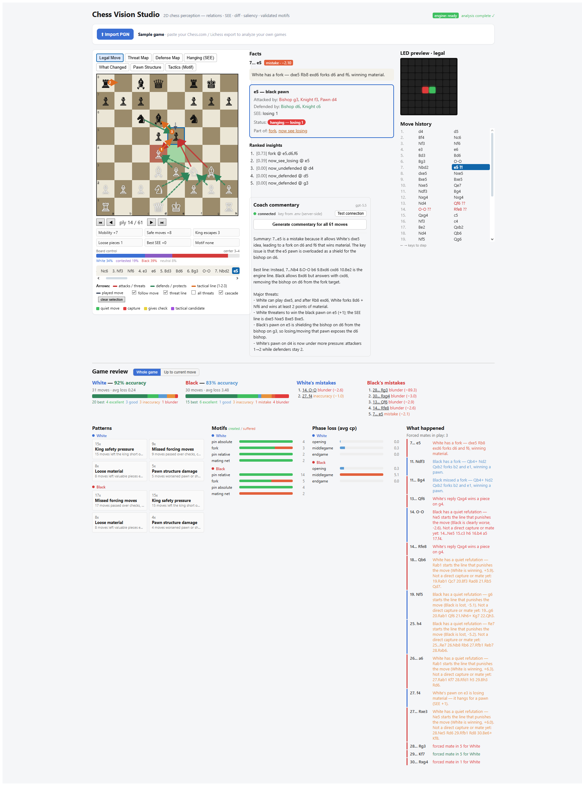
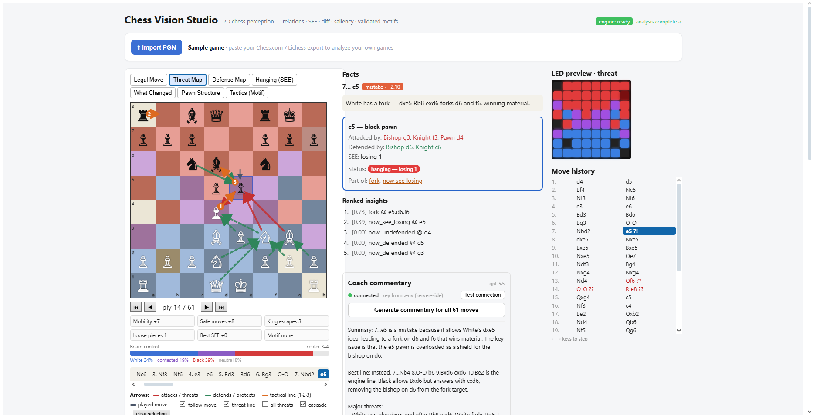
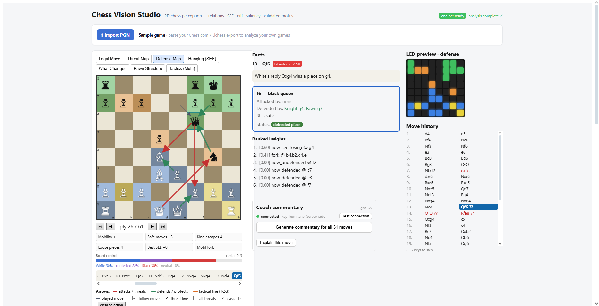
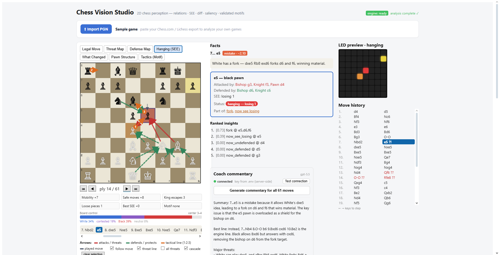
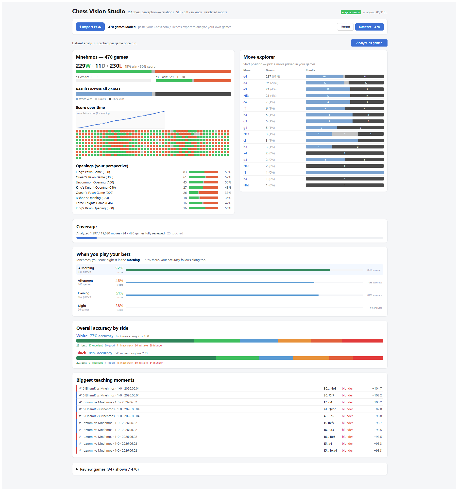
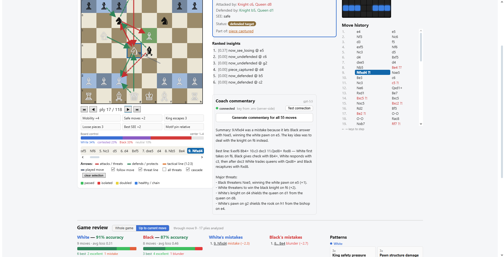

# Chess Vision Studio

**See the forces on the board, not just the engine number.**

Chess Vision Studio is a local-first chess analysis app that turns a position
into visible structure: attackers, defenders, loose pieces, SEE trades, pawn
shape, king pressure, motifs, and the one relationship that changed enough to
matter.

This is a public WIP launch. It is meant to be cloned, installed, and run on
your machine. There is no hosted account system yet.

## Teaching Facts Protocol

The development server exposes `POST /api/cvs-engine/facts`, backed by the Rust
engine's versioned `TeachingFactBundleV1` protocol. Analyze mode compiles those
facts with Stockfish grades into evidence-gated teaching cards, board overlays,
and practice puzzles; the raw response remains available in the debug panel.
See [docs/TEACHING_FACTS_PROTOCOL.md](docs/TEACHING_FACTS_PROTOCOL.md).

## What You Get

- A 2D board that lights up legal moves, threats, defenses, hanging pieces,
  pawn structure, changed relationships, and tactics.
- Move-by-move Stockfish grading with classification, centipawn loss, PV, and
  validated explanations.
- A local CVS Engine panel that shows the Rust engine's best move, score, depth,
  node counts, qsearch footprint, and PV for the same pre-move position Stockfish
  is grading. At the starting position, it searches the board as shown.
- Dataset review for pasted Chess.com or Lichess PGNs, cached locally in the
  browser.
- Optional coach narration through a server-side OpenAI dev proxy. The narrator
  explains validated analysis data, while teaching-card narration receives only
  the committed explanation plan. Neither path is allowed to invent tactics.

## Stockfish And CVS Engine

The app now shows both engine sources explicitly.

| Label in app | What it does | Where it runs |
|---|---|---|
| Stockfish | Browser Stockfish powers move grading, CP loss, PV, What Changed, and dataset analysis. | Browser worker / WASM |
| CVS Engine | The native Rust engine searches the same pre-move position for the selected ply, so its best move can be compared to the played move. At start, it searches the board as shown. | Local Vite dev-server bridge to `analyze --serve` |

If the Rust engine has not been built, Chess Vision Studio still runs. The CVS
Engine badge will say `not found`; Stockfish analysis and the pure perception
overlays continue to work.

## Local Install

Clone both sibling repositories:

```bash
git clone https://github.com/Mnehmos/chess-vision-studio.git
git clone https://github.com/Mnehmos/chess-vision-studio-rust-engine.git
```

Build the native CVS Engine:

```bash
cd chess-vision-studio-rust-engine
cargo build --release
```

Install and run the app:

```bash
cd ../chess-vision-studio
npm install
npm run dev
```

Open:

```text
http://localhost:5173
```

The default Windows bridge path is:

```text
../chess-vision-studio-rust-engine/target/release/analyze.exe
```

On macOS/Linux use:

```text
../chess-vision-studio-rust-engine/target/release/analyze
```

Override paths or search flags in `.env`:

```bash
cp .env.example .env
```

Useful local variables:

```text
CVS_RUST_EXE=../chess-vision-studio-rust-engine/target/release/analyze.exe
CVS_RUST_DEPTH=6
CVS_RUST_BASE=arena/out/value-weights-mixed.json
CVS_RUST_RUNG2=arena/out/rung2-weights-mixed.json
CVS_RUST_FUTILITY=1
CVS_RUST_RFP=0
OPENAI_API_KEY=
```

Restart `npm run dev` after changing `.env`.

## Screens

Analyze a game:



Overlay lenses:

| Threat Map | Defense Map | Hanging / SEE |
|---|---|---|
|  |  |  |

Dataset insights:



Coach commentary:



## Development

Common commands:

```bash
npm test
npm run build
npm run dev
```

Focused checks:

```bash
npx vitest run app/App.test.tsx
npx vitest run engine
npx vitest run arena
```

Rust engine bridge smoke test:

```bash
curl http://localhost:5173/api/cvs-engine/health
curl -X POST http://localhost:5173/api/cvs-engine/analyze \
  -H "Content-Type: application/json" \
  -d "{\"fen\":\"rnbqkbnr/pppppppp/8/8/8/8/PPPPPPPP/RNBQKBNR w KQkq - 0 1\",\"depth\":4}"
```

## Architecture

The browser app has one validated analysis seam, `MoveAnalysis`.

```text
PGN/FEN -> position -> relations -> Stockfish eval -> SEE
        -> diff -> motif validation -> saliency -> explanation
        -> features -> LED map -> React board and dataset analytics

Selected ply pre-move FEN -> Vite /api/cvs-engine -> Rust analyze --serve
                          -> CVS Engine best move, eval, PV, telemetry
```

Main folders:

- `engine/`: pure TypeScript analysis core and testable chess perception logic.
- `app/`: React UI, board overlays, facts, dataset views, play mode, training UI.
- `arena/`: backend engine harnesses, Lichess bot experiments, gauntlets, dataset
  and training scripts.
- `llm/`: optional narrator client and prompts.

## Claim Discipline

This is an early WIP. Strength claims should name the binary, opponent, time
control, game count, weights, and harness. The browser Stockfish worker is useful
inside the app; native cutechess matches in the Rust engine repo are the stronger
external anchor.

## License

[MIT](LICENSE)
