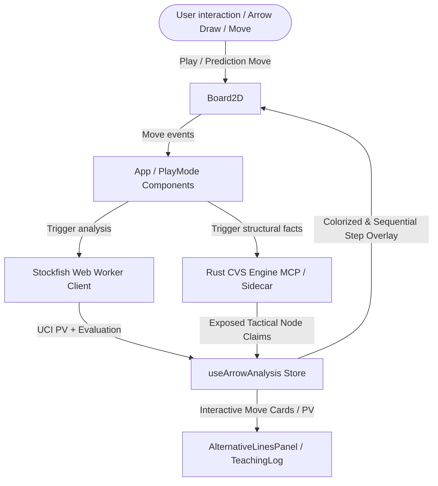

# Chess Vision Studio — Blue Phase Implementation Documentation

This document serves as the comprehensive technical documentation for the **Blue Phase** development milestone. It details the architecture, design choices, user experience details, and testing verification for the coaching perception overlays and evaluation systems.

---

## 1. Architectural Blueprint & Data Flow

Below is a diagram showing the React state, local Stockfish engine, and Rust CVS Engine integration flow.

---

## 2. Core Feature Specifications

### 2.1 Move-Level centipawn & Mate Evaluations
* **Objective:** Direct visual path for locating tactical drops/blunders in calculation lines without spoiling the main line until requested.
* **Details:**
  - Extended `AlternativeLineMove` inside [arrow-analysis-store.ts](file:///f:/Github/chess-vision-studio/app/arrow-analysis-store.ts) to store step-by-step evaluation metrics (`scoreCp` and `mate`).
  - Gated colorization behind `revealed` flag to avoid engine analysis spoiling the board visual before checking the details.
  - Added formatted evaluations next to each prediction move card inside [AlternativeLinesPanel.tsx](file:///f:/Github/chess-vision-studio/app/AlternativeLinesPanel.tsx) (e.g., `1. e4 (+0.25)`).

### 2.2 Standard Chess Notation PV Formatting
* **Objective:** Clean, copy-pasteable standard chess notation in the main engine principal variations.
* **Details:**
  - Created a `formatPv` compiler inside [AlternativeLinesPanel.tsx](file:///f:/Github/chess-vision-studio/app/AlternativeLinesPanel.tsx).
  - Simulates the calculated sequence on a transient `Chess` board state to translate raw UCI lists (e.g., `g8f6 e2e3`) into standard SAN notation.
  - Dynamically calculates the starting ply count and active turn color to output formatted move pairs (e.g., `12... Nf6 13. e3`).

### 2.3 Adaptive "Keep-Active" Predictions
* **Objective:** Allow predictions to stay visually drawn on the board if the game proceeds along the predicted variation.
* **Details:**
  - Integrated `onPredictionBreak` hooks into `useArrowAnalysis`.
  - When a user makes a move on the board, the active variation is verified. If the move matches the first index of the prediction line, the prediction shifts forward and remains drawn.
  - If a move deviates, the prediction is pruned and logged into the **Game Review** panel as a "Break".

### 2.4 Game Review & Auto-Export
* **Objective:** Capture educational insights during play and persist them for post-game review.
* **Details:**
  - Built `ReviewMoment` logs in [PlayMode.tsx](file:///f:/Github/chess-vision-studio/app/PlayMode.tsx).
  - Triggers a background evaluation comparison on prediction break to formulate text explanations (e.g., `Blunder! You played e4 instead of d4, losing 1.50 pawns.`).
  - Automatically exports the compiled JSON teaching corpus to the downloads folder on game completion or manual click.

### 2.5 Board Arrow Annotation Overlay
* **Objective:** Display sequential step orders directly on board arrows to guide analysis.
* **Details:**
  - Replaced the classic chess notation pill (`1.`, `1...`) on midpoint arrows with sequential integers (`1`, `2`, `3`...).
  - Placed overlay numbers at the midpoint of each drawn arrow using high-contrast, rounded badges to prevent overlapping chess pieces.

### 2.6 CSS Grid Unification & Dark Theme Restyle
* **Objective:** Eliminate layout wrapping issues and restore styling harmony.
* **Details:**
  - Adopted global `.cvs-workspace` and `.cvs-gif-capture` CSS grid layouts inside [PlayMode.tsx](file:///f:/Github/chess-vision-studio/app/PlayMode.tsx) to align the play view with the analyze view.
  - Restricted the board wrapper container to a maximum width of `480px` (standard board bounds).
  - Updated [MateCard.tsx](file:///f:/Github/chess-vision-studio/app/MateCard.tsx) to use dark theme design tokens (`var(--card)`, `var(--text-soft)`) with a subtle red accent border.

---

## 3. Verification & Testing Playbook

### 3.1 Automated Verification Suite
We maintain unit and integration tests covering the custom React hooks, UI toggles, and formatting functions:
* **PlayMode UI Tests:** `npx vitest run app/PlayMode.test.tsx`
* **Teaching Log Compiler Tests:** `npx vitest run app/TeachingLog.test.ts`
* **TypeScript Integrity check:** `npx tsc --noEmit`

### 3.2 Manual Quality Checklist
1. **Spoiler Gating:** Draw a variation line. Ensure no engine evaluations are displayed and colors are standard (White/Black) until "Reveal Analysis" is clicked.
2. **Sequential Steps:** Draw a multi-arrow line. Verify numbers `1`, `2`, `3` appear on the arrow midpoints.
3. **Responsive Flow:** Resize the viewport below `980px`. Confirm the grid collapses gracefully into a single-column layout without overflow or overlapping cards.
